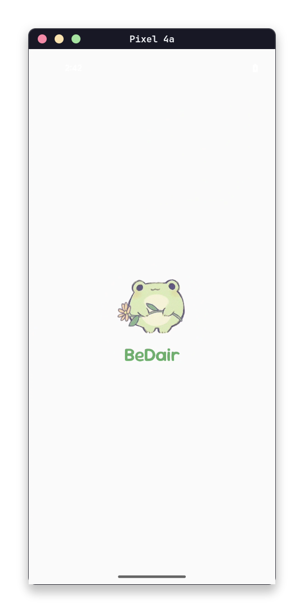
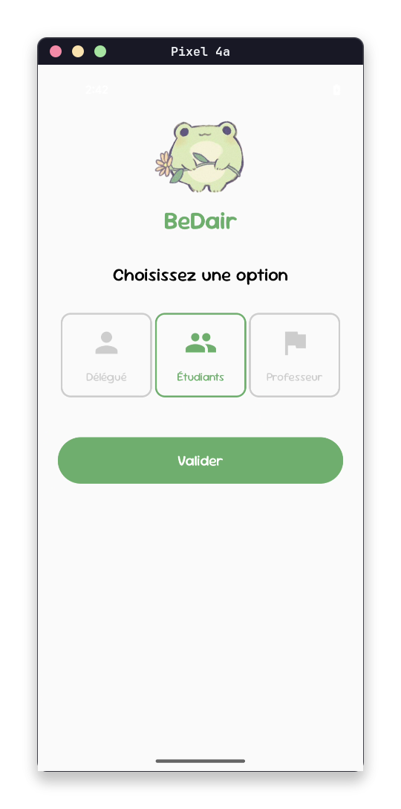
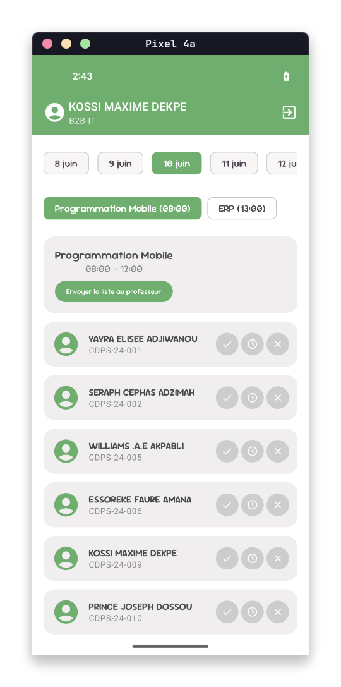

# BeDair - Gestion de Présence Étudiante

BeDair est une application Android pour la gestion des présences universitaires, développée avec **Jetpack Compose** et **Material 3**.

## Fonctionnalités

- **Identification par Rôle** : Étudiant, Délégué et Professeur.
- **Gestion des Présences** : Marquage des présences, absences et retards (2h d'absence par retard).
- **Suivi Étudiant** : Consultation des heures d'absence cumulées sur la semaine.
- **Validation Délégué -> Professeur** : Flux de validation sécurisé des listes de présence.

##  Technologies

- **Kotlin**
- **Jetpack Compose** (UI)
- **Material 3** (Design)
- **MVVM Architecture**
- **Navigation Compose**
- **Gson** (Gestion de la base de données locale en JSON)

## Structure du Projet

Le projet utilise une architecture:
- `data/` : Gestion des fichiers JSON (Base de données locale).
- `domain/model/` : Entités métier (Student, Teacher, Session...).
- `ui/screens/` : Écrans de l'application.
- `ui/components/` : Composants UI réutilisables.
- `viewmodel/` : Logique métier et gestion d'état.

## Captures d'écran

    
    
    

